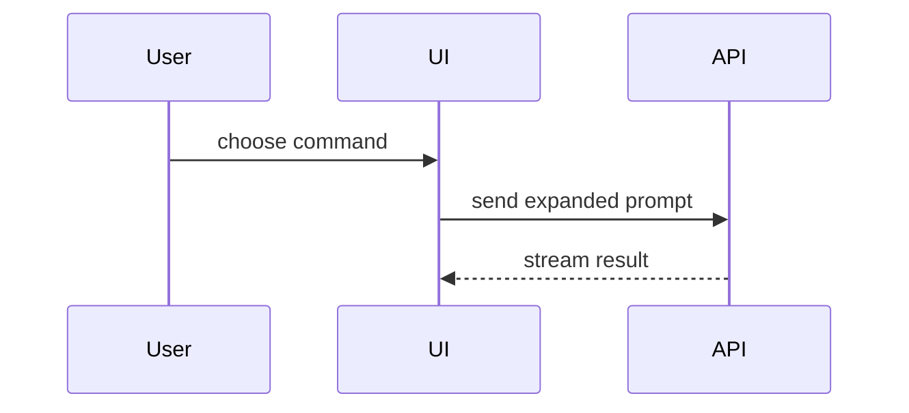

# Diagrams

Pick the smallest visual that makes the point, and place it next to the short text it supports. Derived from humanlayer's `show-me` visual menu, kept to the two forms both backends render: text trees in code blocks and Mermaid. No HTML files, no images.

Keep only the calls, files, components, states and boundaries the document needs. Use one visual, sometimes two; a document full of diagrams hides the one that matters.

## Trees

Plain `text` code blocks render the same in a Markdown file and a Notion code block.

Logic or an algorithm, as pseudocode:

```text
on(save)
  if content is unchanged
    return cached result
  write new content
  return fresh result
```

Runtime control flow, as a call tree:

```text
submitForm
  createSession
    persistPrompt
    launchAgent
  navigateToSession
```

UI structure, as a component tree with the state and module boundaries that matter:

```text
<SessionPage> (apps/web/src/routes/session.tsx)
  useSessionEvents()
  <SessionToolbar>
    <RunSkillButton> (packages/ui)
```

File responsibility, as a shallow file tree:

```text
src/
├── commands/       # parses user actions
├── sessions/       # owns session state
└── transport/      # sends API requests
```

A change to an existing shape, as a `diff` block over any of the trees above. Fits an ADR's consequences or a how-to's before and after:

```diff
 src/
 ├── commands/
-└── transport.ts
+└── transport/
+    ├── client.ts
+    └── stream.ts
```

## Mermaid

Use Mermaid for interaction, control flow and data flow between components: `sequenceDiagram` for a request across services, `flowchart` for a decision or pipeline, `stateDiagram-v2` for a lifecycle, `erDiagram` for a data model.



- Label nodes and edges with the real names from the code.
- Keep a diagram under about 15 nodes. Split a larger one by boundary.
- Explanations and ADRs use diagrams most. A tutorial uses them rarely, a reference only to mirror a structure (a schema, a state machine).
